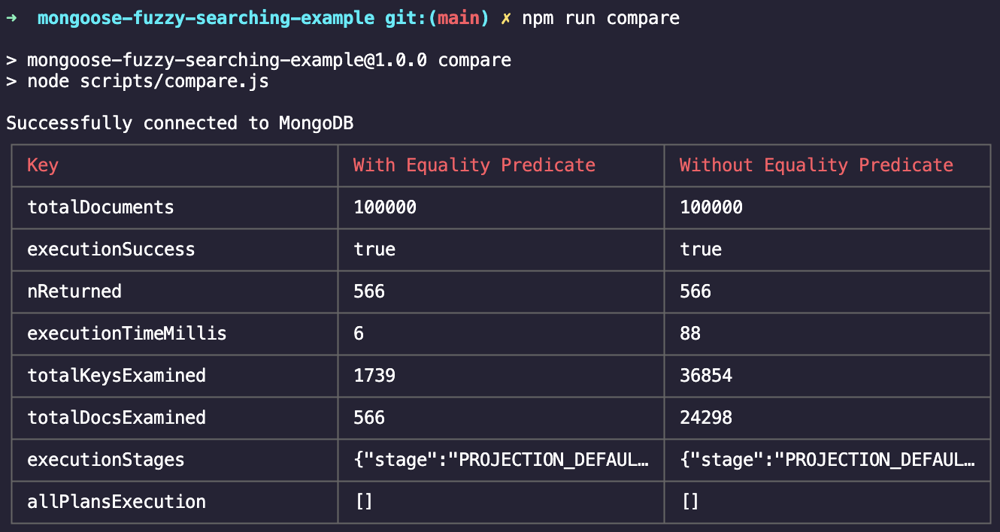

# Fuzzy search comparison

This repository compares 2 mongoose plugins - [manisuec/fuzzily-mongoose](https://github.com/manisuec/fuzzily-mongoose) and [VassilisPallas/mongoose-fuzzy-searching](https://github.com/VassilisPallas/mongoose-fuzzy-searching) - and tries to establish that the former, which makes use of equality predicates, is more efficient that the latter in terms of query performance.

## Setup and run comparison

Ensure you have the latest version of Node.js and MongoDB installed.

```bash
git clone https://github.com/Aditya-ds-2000/Fuzzy-Search-comparison-in-MongoDB.git

cd Fuzzy-Search-comparison-in-MongoDB

npm i --legacy-peer-deps

npm run seed-db # seeds fake data into mongodb and creates indexes

npm run compare # logs a tabular comparison
```

## Sample Output



In terms of both the total documents scanned (566) and total keys scanned (1739), the equality predicates approach is far more efficient than the other approach (24298 and 36854 respectively).
